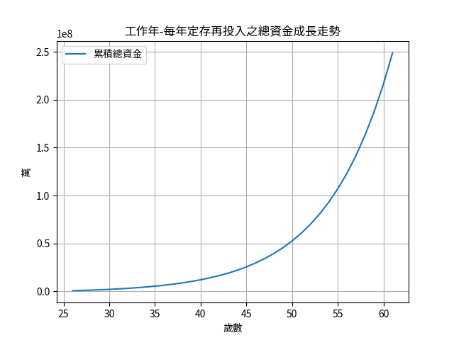
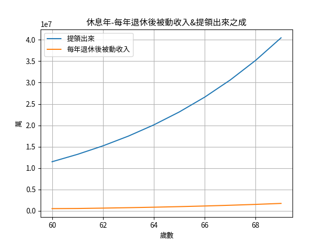

## STEP 1

```code
git clone git@github.com:Junwu0615/ROI-tool.git
```

## STEP 2 

至 Hyper_parameters.py 設置超參數
```
work_year = 34 #只想要工作多久 
year = 26 #年齡 
dead = 95 #想活到幾歲 
money_month = 12 #每月能投入股市資金 
ROI = 15 #投資報酬率 
object_num = 30000000 #預期想要達成金額 
money_once = 0 #一次性金額，如沒填0
```

## STEP 3

執行主程式
```
python ROI.py
```
最後會在 /result 產生 3 個輸出檔

- ROI_result.txt
- 工作年-每年定存再投入之總資金成長走勢.png

- 休息年-每年退休後被動收入&提領出來之成.png


